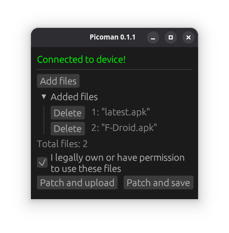

### Speed up game development by automatically installing exported games to Android VR headsets.

This tool can:
- Automatically rename and sign APK files to keep multiple versions of the same game
- Push APK to headset via adb

It is written in Rust🦀 and supports both GUI and CLI.

<!-- To build this project you need to have [just installed.](https://github.com/casey/just) -->
Use the following syntax to build this project:

`cargo --release build`
or
`cargo --release run`

You can find precompiled binaries at [releases page](https://github.com/zamonary1/picoman/releases)

Usage:
`picoman apk --install <file>` - installs APK file to your device. Accepts a
path to file or directory to install every recognised file in folder.

Supported devices:

| Device        | Support  |
| ------------: | :-----:  |
| Pico 4        | ✅       |
| Pico neo 3    | Untested |
| Meta Quest 2  | Planned  |

| Feature        | State |
| -------------- | :---- |
| Apk installing | ✅    |
| Apk signing    | ✅    |
| Apk renaming   | ✅    |

Todo:
1. Bugfixes and stability improvements
2. Installing from other packaging formats (i.e. apk bundled with game cache)
3. Text translation to multiple languages
4. Support for more devices

And more coming soon! 🚀

*All features are currently tested on linux, windows builds may be unstable.

#####   THERE IS NO WARRANTY FOR THE PROGRAM, TO THE EXTENT PERMITTED BY APPLICABLE LAW.  EXCEPT WHEN OTHERWISE STATED IN WRITING THE COPYRIGHT HOLDERS AND/OR OTHER PARTIES PROVIDE THE PROGRAM "AS IS" WITHOUT WARRANTY OF ANY KIND, EITHER EXPRESSED OR IMPLIED, INCLUDING, BUT NOT LIMITED TO, THE IMPLIED WARRANTIES OF MERCHANTABILITY AND FITNESS FOR A PARTICULAR PURPOSE.  THE ENTIRE RISK AS TO THE QUALITY AND PERFORMANCE OF THE PROGRAM IS WITH YOU.  SHOULD THE PROGRAM PROVE DEFECTIVE, YOU ASSUME THE COST OF ALL NECESSARY SERVICING, REPAIR OR CORRECTION.

This project wouldn't be possible without these amazing projects, consider going to their respective github pages and giving them a star:

[APKEditor by REAndroid](https://github.com/REAndroid/APKEditor), which is licensed under [Apache License 2.0](https://github.com/REAndroid/APKEditor/blob/master/LICENSE)

[Uber Apk Signer by Patrick Favre](https://github.com/patrickfav/uber-apk-signer), it is licensed under [Apache License 2.0](https://github.com/patrickfav/uber-apk-signer/blob/main/LICENSE) too.

And all of project dependencies. You can look at them in [Cargo.toml](Cargo.toml#L20)
